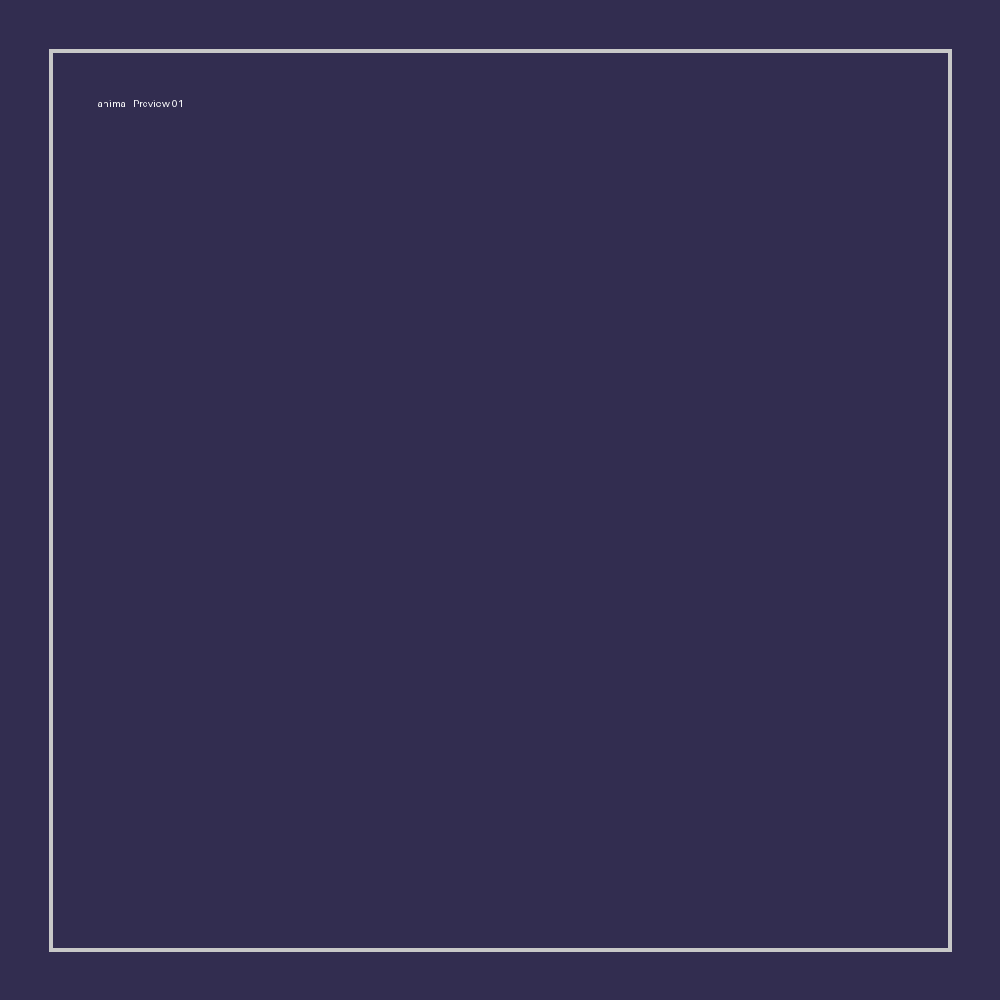
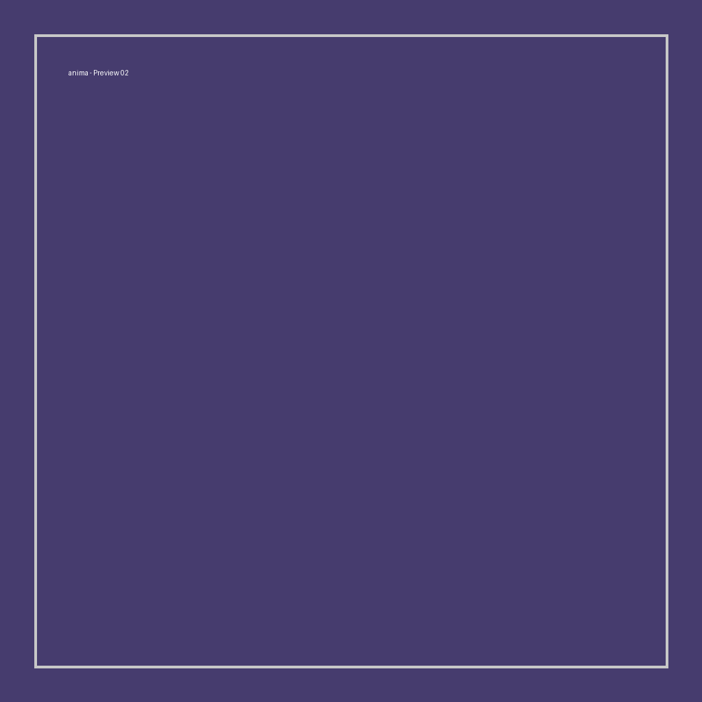
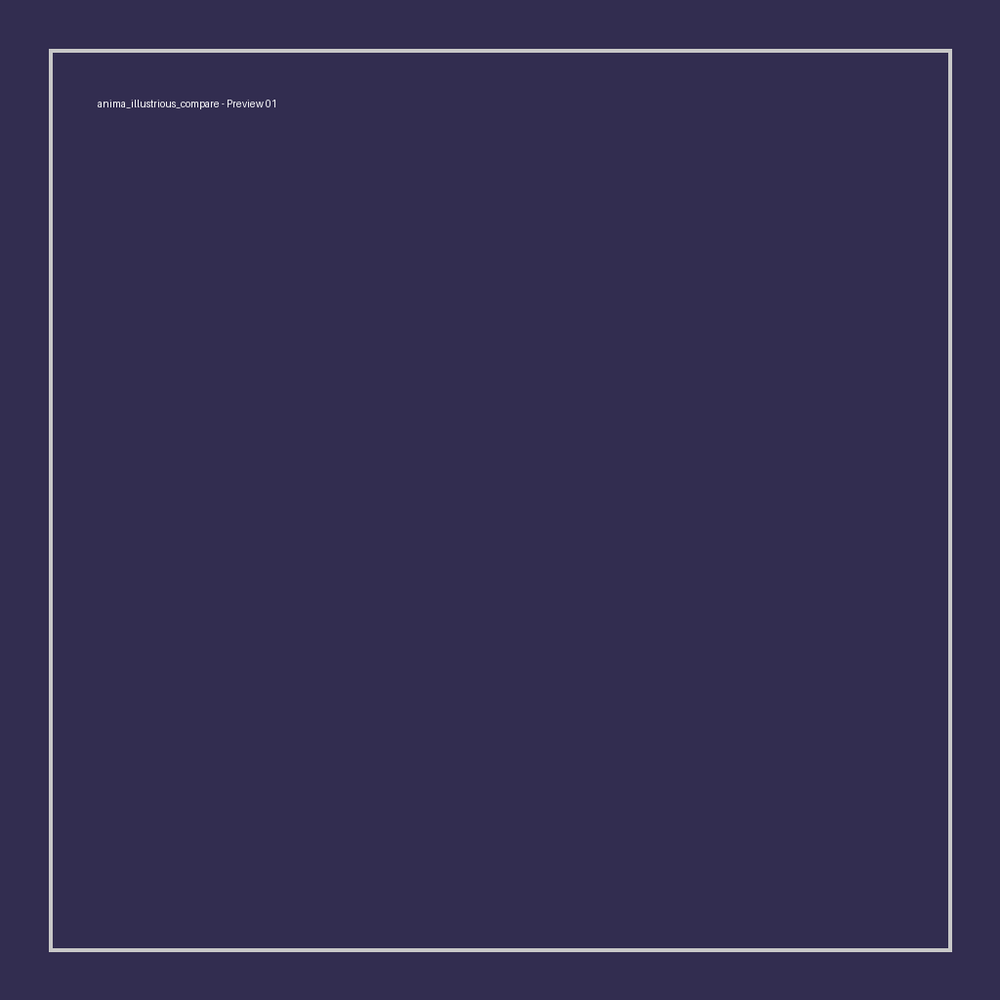
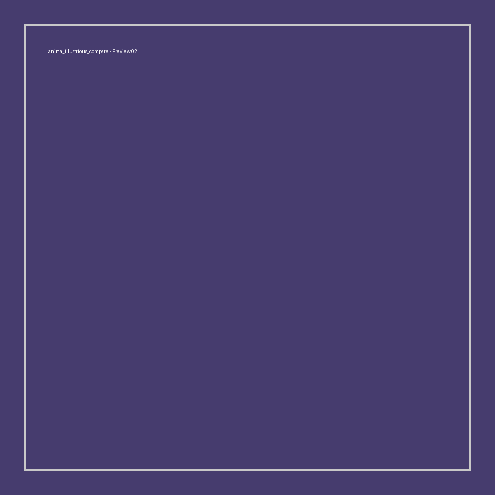
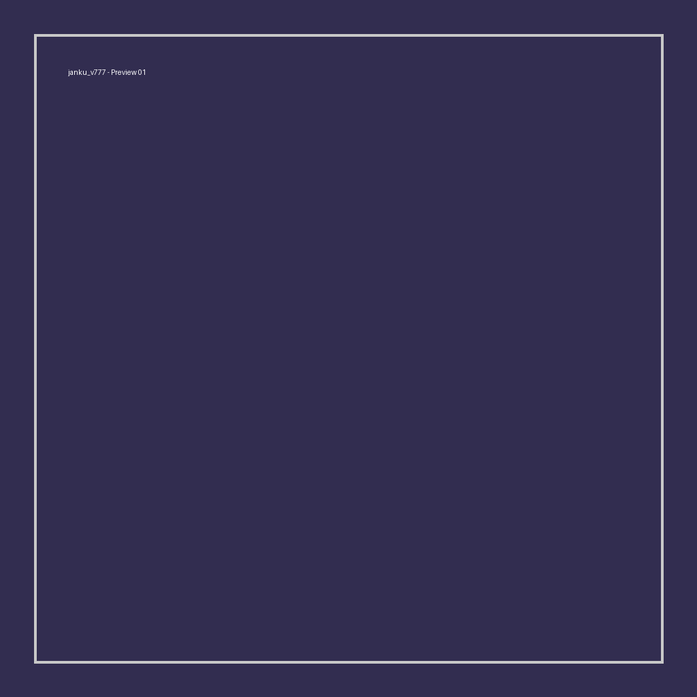
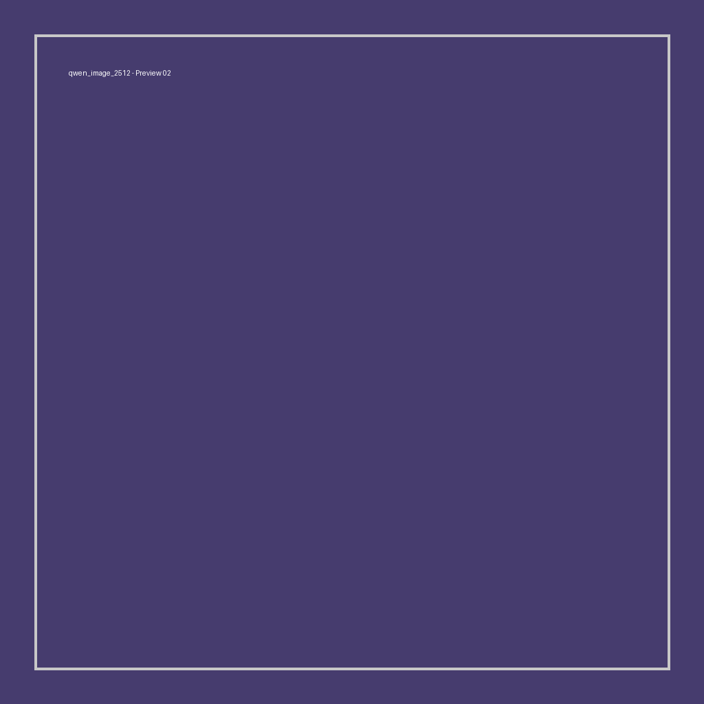
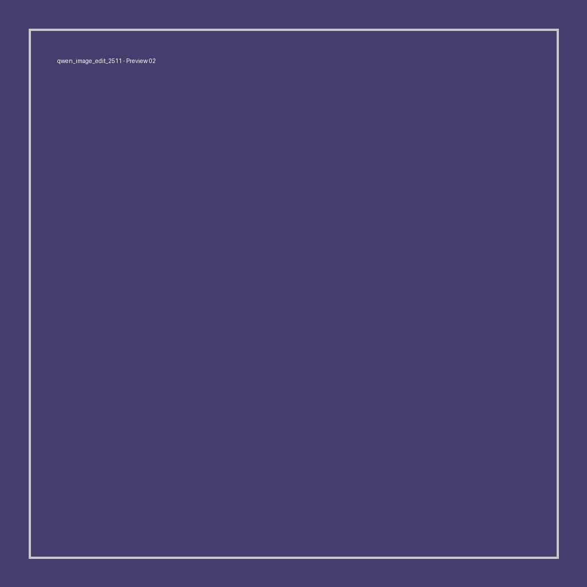
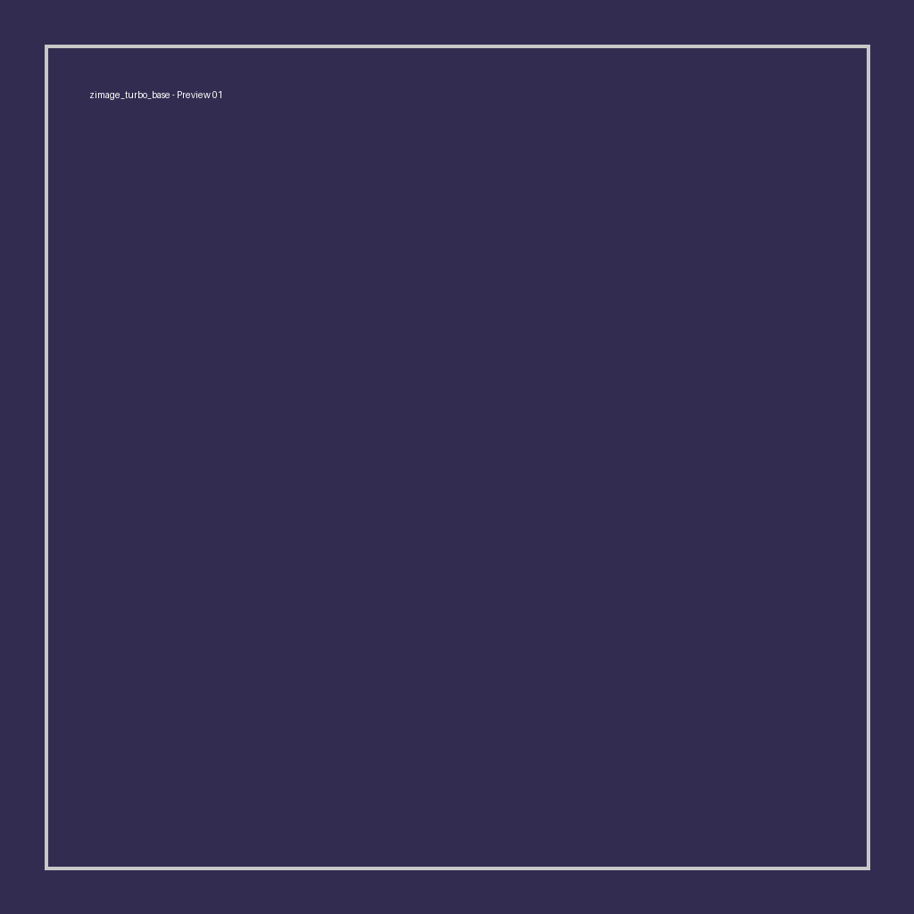

# Free ComfyUI Colab Pack


[](https://boosty.to/ekkonwork/donate)
[](https://www.linkedin.com/in/mikhail-kuznetsov-14304433b)

Free Google Colab notebooks for popular ComfyUI workflows on low VRAM GPUs (focused on Colab Free T4).

## Why this project
I put a lot of time and effort into these notebooks. They are tuned, tested, and maintained so people can run popular models for free in Colab.

The goal is simple: fast, practical, and stable model access in Colab without heavy local setup.

## Killer Features
- Auto quant selection by VRAM budget (rare in public Colab packs).
- GGUF-first setup for low VRAM use cases.
- Match-only Lenovo UltraReal LoRA download by base-model tag.
- Built-in Hugging Face + Civitai token prompts.
- Stable Cloudflare tunnel launch logic with retries and health checks.
- Optional ultra-low-VRAM launch mode for large images (`--novram`, smart-memory off, cache disabled, forced upcast attention).
- Workflow Models Downloader custom node is installed alongside ComfyUI-Manager.
- Low-VRAM defaults for Colab T4 (memory-aware settings).
- Every supported notebook installs exactly one bundled workflow into ComfyUI automatically.
- GGUF notebooks already use connected `UnetLoaderGGUF`, `CLIPLoaderGGUF`, or `DualCLIPLoaderGGUF` nodes; selected runtime quant filenames are synchronized after model download.

See [workflow sources and adaptations](docs/WORKFLOW_SOURCES.md).

## Notebook Catalog
### Flux SRPO
[](https://colab.research.google.com/github/ekkonwork/free-comfyui-colab-pack/blob/main/notebooks/flux_srpo/comfy_flux_srpo.ipynb)
- What: FLUX-based SRPO GGUF text-to-image notebook using the Tencent SRPO workflow architecture.
- Model creators/sources: FLUX.1 family by Black Forest Labs, SRPO model by Tencent Hunyuan (`tencent/SRPO`), GGUF conversion pack by `befox` (`srpo-Q2_K.gguf` 4.0G + `t5-v1_1-xxl-encoder-Q4_K_M.gguf` 2.9G).
- Workflow: `workflows/flux_srpo/workflow.json` — official Tencent graph adapted to connected GGUF UNET + dual CLIP loaders. Notebook substitutes the selected quant filenames automatically.

### Flux2 Klein 9B GGUF
[](https://colab.research.google.com/github/ekkonwork/free-comfyui-colab-pack/blob/main/notebooks/flux2_klein9b_gguf/comfy_flux2_klein9b_gguf.ipynb)
- What: Flux.2 Klein 9B base/distilled GGUF notebook for T2I and edit flows.
- Model creators/sources: FLUX.2 family by Black Forest Labs, GGUF releases by `unsloth`, VAE package by `Comfy-Org`.
- Workflow: `workflows/flux2_klein9b_gguf/workflow.json` — one Comfy-Org 9B graph adapted to GGUF loaders.

### Z-Image Base
[](https://colab.research.google.com/github/ekkonwork/free-comfyui-colab-pack/blob/main/notebooks/zimage_base/comfy_zimage_base.ipynb)
- What: Z-Image Base GGUF setup using the official Comfy-Org graph architecture.
- Model creators/sources: original Z-Image by `Tongyi-MAI` (`Tongyi-MAI/Z-Image`), GGUF ports by `unsloth`, ComfyUI split assets used from `Comfy-Org/z_image`.
- Workflow: `workflows/zimage_base/workflow.json` — official Base graph adapted to connected GGUF UNET + Qwen3 loaders.

### Z-Image Turbo
[](https://colab.research.google.com/github/ekkonwork/free-comfyui-colab-pack/blob/main/notebooks/zimage_turbo/comfy_zimage_turbo.ipynb)
- What: fast Z-Image Turbo GGUF notebook for speed-first generation.
- Model creators/sources: original Z-Image Turbo by `Tongyi-MAI` (`Tongyi-MAI/Z-Image-Turbo`), GGUF ports by `unsloth`, ComfyUI split assets used from `Comfy-Org/z_image`.
- Workflow: `workflows/zimage_turbo/workflow.json` — official Turbo graph adapted to connected GGUF UNET + Qwen3 loaders.

### Z-Image Turbo + Base
[](https://colab.research.google.com/github/ekkonwork/free-comfyui-colab-pack/blob/main/notebooks/zimage_turbo_base/comfy_zimage_turbo_base.ipynb)
- What: combo notebook with Turbo + Base variants in one setup.
- Model creators/sources: original Z-Image models by `Tongyi-MAI` (`Tongyi-MAI/Z-Image` and `Tongyi-MAI/Z-Image-Turbo`), GGUF variants by `unsloth`, ComfyUI split assets used from `Comfy-Org/z_image`.
- Workflow: `workflows/zimage_turbo_base/workflow.json` — Turbo and Base branches on one canvas, one selectable file.

### Z-Image Turbo notebook (SeedVR2 excluded from bundled flow)
[](https://colab.research.google.com/github/ekkonwork/free-comfyui-colab-pack/blob/main/notebooks/zimage_seedvr2/comfy_zimage_seedvr2.ipynb)
- What: notebook retains optional SeedVR2 model setup, but its single bundled workflow is clean Z-Image Turbo generation only.
- Model creators/sources: original Z-Image Turbo by `Tongyi-MAI` (`Tongyi-MAI/Z-Image-Turbo`) with GGUF ports by `unsloth`, SeedVR2 node/files by `numz` and GGUF pack by `cmeka`.
- Workflow: `workflows/zimage_seedvr2/workflow.json`; no SeedVR2 nodes are present.

### Qwen Image 2512
[](https://colab.research.google.com/github/ekkonwork/free-comfyui-colab-pack/blob/main/notebooks/qwen_image_2512/comfy_qwen_image_2512.ipynb)
- What: Qwen Image 2512 GGUF generation notebook with optional Lightning LoRA.
- Model creators/sources: Qwen family by Alibaba/Qwen team, GGUF packs by `unsloth` and `ggml-org`, Lightning LoRA by `lightx2v`.
- Workflow: `workflows/qwen_image_2512/workflow.json` — official Comfy-Org graph with GGUF loaders and runtime LoRA filename synchronization.

### Qwen Image Edit 2511
[](https://colab.research.google.com/github/ekkonwork/free-comfyui-colab-pack/blob/main/notebooks/qwen_image_edit_2511/comfy_qwen_image_edit_2511.ipynb)
- What: Qwen Image Edit 2511 notebook for image editing use cases.
- Model creators/sources: Qwen family by Alibaba/Qwen team, GGUF packs by `unsloth` and `ggml-org`, Lightning LoRA by `lightx2v`.
- Workflow: `workflows/qwen_image_edit_2511/workflow.json` — official Comfy-Org edit graph with GGUF loaders and runtime LoRA filename synchronization.

### Chroma1 HD GGUF
[](https://colab.research.google.com/github/ekkonwork/free-comfyui-colab-pack/blob/main/notebooks/chroma1_hd_gguf/comfy_chroma1_hd_gguf.ipynb)
- What: Chroma1-HD text-to-image GGUF notebook; the bundled graph uses real Chroma, not a Z-Image fallback.
- Model creators/sources: Chroma1-HD by `lodestones`, GGUF package by `silveroxides`.
- Workflow: `workflows/chroma1_hd_gguf/workflow.json` — author Chroma graph adapted to connected Chroma GGUF + FLAN-T5 GGUF loaders.

### Anima + WAI-Anima
[](https://colab.research.google.com/github/ekkonwork/free-comfyui-colab-pack/blob/main/notebooks/anima/comfy_anima_colab.ipynb)
- What: native Anima Aesthetic v1.1 and WAI-Anima v1.0 workflows for T2I, ControlNet and inpainting.
- Includes: ComfyUI-Manager, Anima-LLLite, ControlNet preprocessors, Lora Manager and the exact workflow variants from the v45 archive.
- Models: both Anima checkpoints are downloaded; the notebook writes WAI and Aesthetic workflow variants so either model can be selected.
- Workflow: `workflows/anima/workflow.json`, installed into ComfyUI automatically.

### Anima Illustrious Compare (Anima + 3 Illustrious)
[](https://colab.research.google.com/github/ekkonwork/free-comfyui-colab-pack/blob/main/notebooks/anima_illustrious_compare/comfy_anima_illustrious_compare.ipynb)
- What: единый compare-ноутбук для 4 моделей — Anima Aesthetic v1.1 (diffusion model) + RouWei v0.8.0 epsilon + Nova Anime XL IL v19.0 + JANKU v7.77 — с 10 сложными промптами (gravity_workshop, mirror_train, ... museum_giant), seed 424242. Ставит единый Qwen VAE/text-enc + LLLite patch.
- Models: `diffusion_models/anima/anima_aestheticV11.safetensors` + 3× `checkpoints/*.safetensors` (VAE baked in для SDXL), см. `compare/models.json` style manifest внутри ноутбука.
- Workflows: встроенный `graph_for` (UNETLoader/CLIPLoader/VAELoader for anima, CheckpointLoaderSimple for SDXL) + queue 40 jobs.

### RouWei v0.8.0 epsilon (Illustrious)
[](https://colab.research.google.com/github/ekkonwork/free-comfyui-colab-pack/blob/main/notebooks/rouwei_v080_epsilon/comfy_rouwei_v080_epsilon.ipynb)
- What: SDXL checkpoint RouWei v0.8.0 epsilon — лучший prompt adherence среди anime SDXL на релиз, 50k+ артистов, без watermark, epsilon (CFG 7, 24 steps euler_ancestral/normal).
- Model creators/sources: `Minthy/RouWei` (fine-tune Illustrious v0.1), Civitai `950531/1832460`.
- Workflow: `workflows/rouwei_v080_epsilon/workflow.json` — checkpoint → base KSampler → second KSampler/refiner → FaceDetailer → Hand Detailer → SaveImage.

### Nova Anime XL IL v19.0 (Illustrious)
[](https://colab.research.google.com/github/ekkonwork/free-comfyui-colab-pack/blob/main/notebooks/nova_anime_xl_il_v190/comfy_nova_anime_xl_il_v190.ipynb)
- What: Nova Anime XL IL v19 — anime/2.5D/3D SDXL, серия из 20+ версий, Pony/Illustrious hybrid.
- Model creators/sources: Nova Anime team, Civitai `376130/2940478`.
- Workflow: `workflows/nova_anime_xl_il_v190/workflow.json` — checkpoint → base KSampler → second KSampler/refiner → FaceDetailer → Hand Detailer → SaveImage.

### JANKU v7.77 (Illustrious + RouWei)
[](https://colab.research.google.com/github/ekkonwork/free-comfyui-colab-pack/blob/main/notebooks/janku_v777/comfy_janku_v777.ipynb)
- What: JANKU v7.77 — Illustrious XL merge с Chenkin/NoobAI/RouWei, LoRA-free, улучшенная анатомия/NSFW, 1536 без upscale.
- Model creators/sources: JANKU (janxd), Civitai `1277670/2786084`, base `NoobAI-XL 1.0 License`.
- Workflow: `workflows/janku_v777/workflow.json` — checkpoint → base KSampler → second KSampler/refiner → FaceDetailer → Hand Detailer → SaveImage; VAE baked in.

## Paused (Not In Active Testing)
- `notebooks/_paused/ltx2_gguf/`
- `notebooks/_paused/wan22_14b_combo/`

## Repository Layout
```text
free-comfyui-colab-pack/
  notebooks/<model>/comfy_<model>.ipynb
  workflows/<model>/workflow.json
  docs/
  previews/<model>/
```

## Quick Start
1. Open a notebook from `notebooks/<model>/` in Colab.
2. Run cells top-to-bottom.
3. Enter Hugging Face token when asked.
4. Enter Civitai token when asked (recommended for LoRA downloads).
5. Open the generated Cloudflare link and choose the notebook-named flow in ComfyUI's Workflows menu.

For 1K+ images on free Colab, set `LOW_VRAM_STABLE = True` in the launch cell. This trades speed for stability.

## Support
If these notebooks save you time, please support development:

[](https://boosty.to/ekkonwork/donate)
[](https://boosty.to/ekkonwork/donate)

### Crypto Donations (Telegram Wallet)
[](https://t.me/wallet)


## Hire Me
[](https://www.linkedin.com/in/mikhail-kuznetsov-14304433b)
[](https://www.linkedin.com/in/mikhail-kuznetsov-14304433b)

- Email: `ekkonwork@gmail.com`
- Telegram: `@Mikhail_ML_ComfyUI`

## Preview Gallery (Square HD 1024x1024 — Face/Hand Detailer + Refiner)
*Verified square HD previews — each 1024×1024, FaceDetailer `face_yolov8m.pt` + HandDetailer `hand_yolov8n.pt` + Refiner (self-refine denoise 0.3), unique complex prompts with beautiful girl.*

| Notebook | Preview 01 | Preview 02 |
|---|---|---|
| RouWei v0.8.0 epsilon |  |  |
| Anima + WAI-Anima |  |  |
| Anima Illustrious Compare |  |  |
| Chroma1 HD GGUF |  |  |
| Flux2 Klein 9B GGUF |  |  |
| Flux SRPO |  |  |
| JANKU v7.77 |  |  |
| Nova Anime XL IL v19.0 |  |  |
| Qwen Image 2512 |  |  |
| Qwen Image Edit 2511 |  |  |
| Z-Image Base |  |  |
| Z-Image SeedVR2 |  |  |
| Z-Image Turbo |  |  |
| Z-Image Turbo + Base |  |  |
